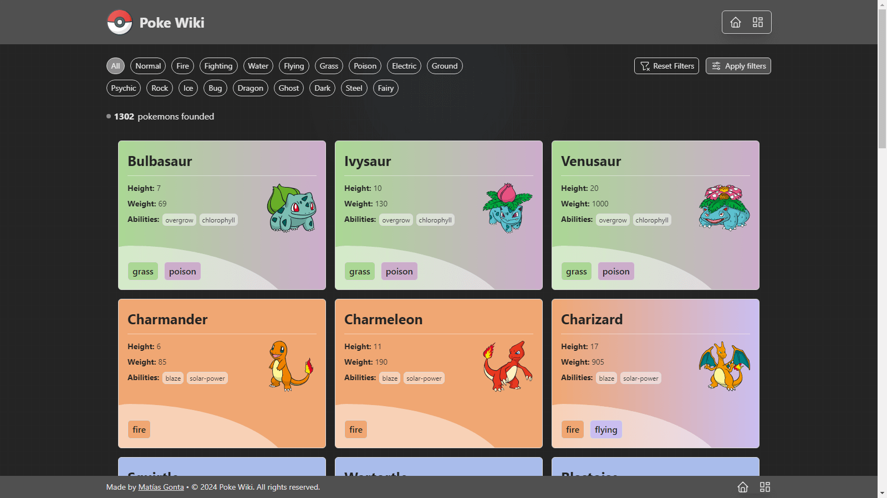

<p align="center">
  
</p>

---

# Poke Wiki

Poke Wiki is a web application that provides information about Pokémon, allowing users to explore different Pokémon types, view details about individual Pokémon, and more.



## Installation

1. Clone the repository:

   ```bash
   git clone https://github.com/MatiasGonta/poke-wiki.git

2. Navigate to the project directory:

   ```bash
   cd poke-wiki

3. Install dependencies:

   ```bash
   npm install

## Usage

1. To start the development server, run the following command:

   ```bash
   npm run dev

This will launch the application in development mode. Open your browser and visit <http://localhost:5173> to view the Poke Wiki app.

## Technologies Used

- <a href="https://react.dev/" target="_blank">**React**</a>: A JavaScript library for building interactive user interfaces.
- <a href="https://www.typescriptlang.org/docs/" target="_blank">**TypeScript**</a>: A superset of JavaScript that adds static types and other features to the language syntax.
- <a href="https://tailwindcss.com/" target="_blank">**Tailwind CSS**</a>: A utility-first CSS framework that simplifies styling by providing low-level utility classes, enabling a straightforward and fast approach to building modern and responsive interfaces.
- <a href="https://vitejs.dev/" target="_blank">**Vite**</a>: A fast build tool, which significantly improves the frontend development experience.
- <a href="https://axios-http.com/" target="_blank">**Axios**</a>: A promise-based HTTP client for making API requests, used for fetching data in the Poke Wiki app.
- <a href="https://reactrouter.com/en/main" target="_blank">**React Router Dom**</a>: It is a library for declarative and dynamic navigation in React applications, allowing the management of routes and views efficiently.
- <a href="https://github.com/ankeetmaini/react-infinite-scroll-component" target="_blank">**React Infinite Scroll Component**</a>: Is a React component that makes it easy to implement infinite scrolling, automatically loading more content as the user gets closer to the end of the page.
- <a href="https://www.tremor.so/" target="_blank">**Tremor**</a>: A collection of components that helps create charts and dashboards. Within its operation it uses the "@headlessui/react" and "@headlessui/tailwindcss" packages.
- <a href="https://fontsource.org/fonts/rubik" target="_blank">**@fontsource-variable/rubik**</a>: Provides the Rubik font for typography in the application.

## Project Structure

- `public`: Contains static assets such as images and icons used in the application.
- `src/components`: Contains reusable components used in different parts of the application.
- `src/hooks`: Contains custom hooks responsible for encapsulating and managing complex logic.
- `src/layouts`: Contains files where the general structure of the sections or pages of the application is defined, acting as a template to achieve visual coherence.
- `src/pages`: Contains all the pages within the application. Each page has its dedicated folder with the same name, which have its corresponding file (.tsx) and potentially additional subdirectories, such as a "components" folder containing components used only in it.
- `src/models`: Contains TypeScript interfaces, enums or types used for defining data structures.
- `src/services`: Contains the Pokémon service responsible for fetching data from the PokéAPI.
- `src/utils`: Contains utilities and helper functions used in the application.

## Authors

- Matías Gonta

If you have any questions, concerns or interest, feel free to contact me.

---

<p align="center">
  
</p>

---

# Poke Wiki

Poke Wiki es una aplicación web que proporciona información sobre Pokémon, lo que permite a los usuarios explorar diferentes tipos de Pokémon, ver detalles sobre un Pokémon y más.


## Instalación

1. Clonar el repositorio:

   ```bash
   git clone https://github.com/MatiasGonta/poke-wiki.git

2. Ir al directorio o carpeta del proyecto:

   ```bash
   cd poke-wiki

3. Instalar dependencias:

   ```bash
   npm install

## Uso

1. Para iniciar el servidor de desarrollo, ejecute el siguiente comando:

   ```bash
   npm run dev

Esto iniciará la aplicación en modo de desarrollo. Abra su navegador y visite <http://localhost:5173> para ver la aplicación Poke Wiki.

## Tecnologías utilizadas

- <a href="https://react.dev/" target="_blank">**React**</a>: Una biblioteca de JavaScript para crear interfaces de usuario interactivas.
- <a href="https://www.typescriptlang.org/docs/" target="_blank">**TypeScript**</a>: Un superconjunto de JavaScript que agrega tipos estáticos y otras funciones a la sintaxis del lenguaje.
- <a href="https://tailwindcss.com/" target="_blank">**Tailwind CSS**</a>: Un framework de CSS centrado en las utilidades, que simplifica el estilo al proporcionar clases de utilidades de bajo nivel, lo que permite un enfoque sencillo y rápido para crear interfaces modernas y responsivas.
- <a href="https://vitejs.dev/" target="_blank">**Vite**</a>: Una herramienta rápida de construcción, que mejora significativamente la experiencia de desarrollo frontend.
- <a href="https://axios-http.com/" target="_blank">**Axios**</a>: Un cliente HTTP basado en promesas para realizar solicitudes API, utilizado para recuperar datos en la aplicación.
- <a href="https://reactrouter.com/en/main" target="_blank">**React Router Dom**</a>: Es una biblioteca para la navegación declarativa y dinámica en aplicaciones React, que permite gestionar rutas y vistas de manera eficiente.
- <a href="https://github.com/ankeetmaini/react-infinite-scroll-component" target="_blank">**React Infinite Scroll Component**</a>: Es un componente de React que facilita la implementación del desplazamiento infinito, cargando automáticamente más contenido a medida que el usuario se acerca al final de la página.
- <a href="https://www.tremor.so/" target="_blank">**Tremor**</a>: Una colección de componentes que ayuda a crear gráficos y dashboards. Dentro de su funcionamiento utiliza los paquetes "@headlessui/react" y "@headlessui/tailwindcss".
- <a href="https://fontsource.org/fonts/rubik" target="_blank">**@fontsource-variable/rubik**</a>: Proporciona la fuente Rubik para la tipografía en la aplicación.

## Estructura del proyecto

- `public`: Contiene imágenes e iconos utilizados en la aplicación.
- `src/components`: Contiene componentes reutilizables utilizados en diferentes partes de la aplicación.
- `src/hooks`: Contiene hooks personalizados responsables de encapsular y gestionar lógica compleja.
- `src/layouts`: Contiene archivos donde se define la estructura general de las secciones o páginas de la aplicación, actuando como plantilla para lograr coherencia visual.
- `src/pages`: Contiene todas las páginas dentro de la aplicación. Cada página tiene su carpeta dedicada con el mismo nombre, la cual tiene su archivo correspondiente (.tsx) y posiblemente directorios adicionales, como una carpeta "components" que contiene componentes utilizados solo en esa página.
- `src/models`: Contiene interfaces, enums o tipos de TypeScript utilizados para definir estructuras de datos.
- `src/services`: Contiene el servicio Pokémon responsable de obtener datos de PokéAPI.
- `src/utils`: Contiene utilidades y funciones auxiliares utilizadas en la aplicación.

## Autores

- Matías Gonta

Si tiene alguna pregunta, inquietud o interés, no dude en ponerse en contacto conmigo.